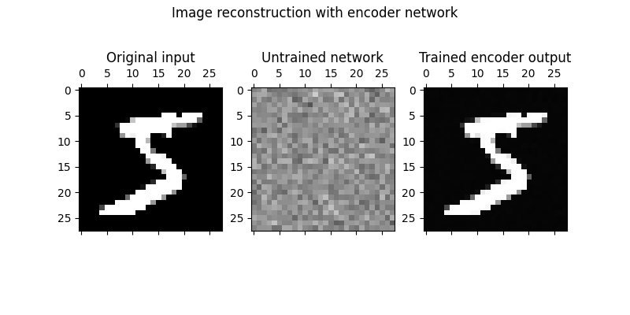
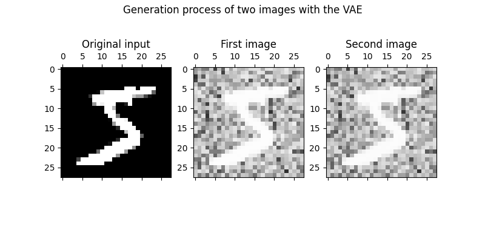
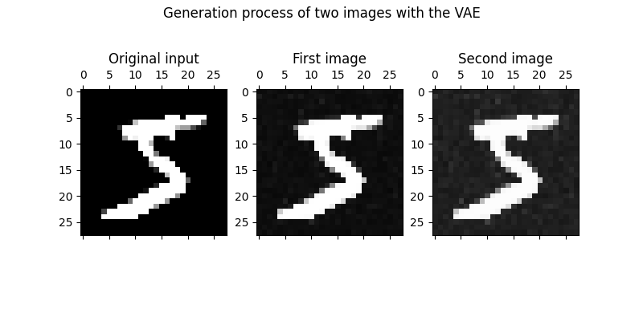

# Variational Autoencoder built from scratch

Variational Autoencoders (VAEs) are used to generate novel data based on the input they're trained on. To enable such behavior, VAEs rely on Variational Inference (which is in fact a familiar method to e.g. Expectation Maximization since they both use the KL-Divergence/ELBO to [approximate](https://stillbreeze.github.io/Variational-Inference-and-Expectation-Maximization/) the target distribution) as the theoretical statistical foundation.

## Encoder

The figure below shows the usage of just the encoder class used as a Autoencoder. The first graphic shows the original image that is used to the train network. The second image is the random output when the Autoencoder remains untrained. The third and last graphic shows the reconstructed image based on the first image after the network was trained with 5 iterations.

## VAE
The encoder network part learns the latent variable (or parameters) representation of the input data. To approximate the target distribution with the latent variables help, the KL-Divergence (which is more precisely done by maximising the ELBO) is used. Finally, the latent variables are summed up to a vector, which will be the input of the decoder network to generate a new image.

Figure 2 shows the generation of two images when the VAE was trained with 5 iterations.

Figure 3 shows another generation of two images when the VAE was trained with 10 iterations.

The variance of the generated images gets more visible when one starts looking into the exact pixel values: A slight difference of the intensitiy for each generation can be found here, while it is still close to the original image.

## Conclusion

If comparing the learning process to reconstruct the original image, the VAE needs more iterations than the Autoencoder. Figures 1 and 2 were trained with 5 iterations each, yet the Autoencoder is faster to learn the image's features.